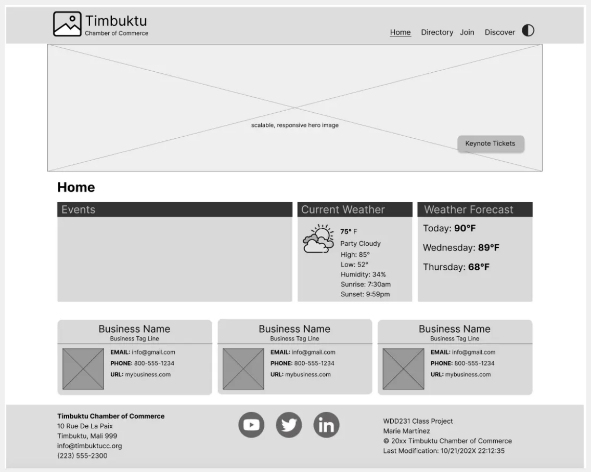
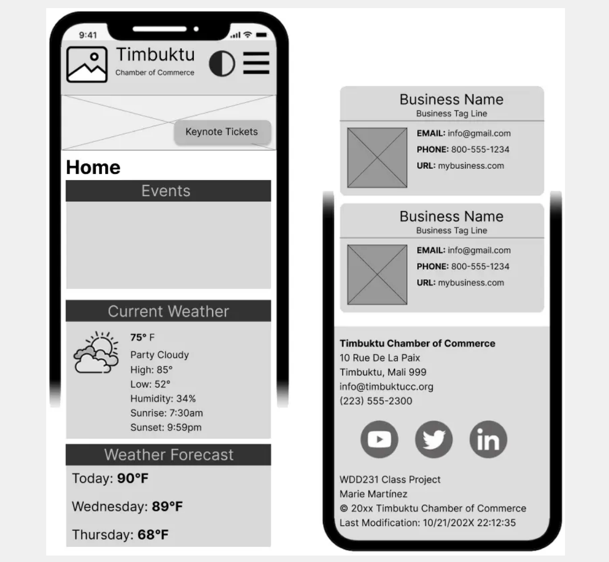

#### Site Name

Phoenix Chamber of Commerce

#### Site Purpose

Central hub for businesses in Phoenix, promoting economic growth, supporting local enterprises, and fostering community connections.

#### Target Market

Business owners, entrepreneurs, and residents in Phoenix and surrounding areas.

#### Site Goals

-   Enhance member engagement by providing valuable resources and networking opportunities.
-   Attract new businesses and promote economic development in Phoenix.
-   Establish the chamber as a trusted authority on local business matters and community development.

#### User Personas

-   **Small Business Owner**: Maria is a 35-year-old entrepreneur who owns a small boutique shop in town. She is looking for networking opportunities, business resources, and marketing support to help grow her business.
-   **Corporate Executive**: Diego is a 47-year-old executive at a large company looking for growth opportunities. His company is interested in partnership opportunities, economic development resources, and networking with other business leaders in the area
-   **The New Resident**: Francisco recently moved into the community and is looking to learn more about services available in the area. He is interested in finding business directories, event calendars, and community service opportunities.

#### Scenarios

-   A local business owner is interested in joining the chamber of commerce to network with other business owners. They visit the website to find information on membership benefits, fees, and how to apply.
-   A community member is looking for upcoming events and workshops hosted by the chamber. They visit the website to browse the events calendar and register for interesting activities.
-   A visitor from out of town is considering relocating to the area and wants to learn more about the local business environment. They explore the chamber's website for information on existing businesses, availability of skilled labor, and quality of life in the area.

#### SEO Plan

-   Use relevant keywords in site descriptions, content, and blog posts.
-   Verify the site on Google’s Business Profile.
-   Get inbound links or backlinks from all member business to improve rankings.
-   Embed Google Analytics in all site pages.

#### Design Brief

Primary Color #CE5C35  
Secondary Color #4B878B
Background Color: #F5F1E3  
Text Color #2C2C2C
Font Family: 'Montserrat' for headings, 'Open Sans' for body text

#### Site Map

Home | Discover Phx | Business Directory | Join the Chamber | About Us | Events | Resources

#### Wireframes

##### Desktop

##### Mobile

